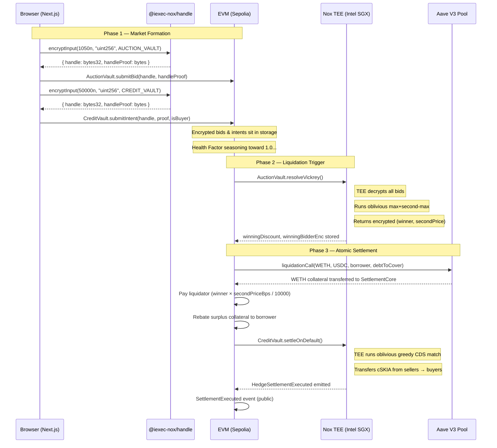

# Skia — Confidential Liquidation & Credit Protection for Aave V3

> **iExec Nox Hackathon Submission** · Sepolia Testnet · Next.js + Solidity
>
> [](https://github.com/Xconmax245/Skia/actions/workflows/ci.yml)

Skia is a two-sided DeFi protocol that brings **cryptographic confidentiality** to Aave V3 liquidations and credit default swaps, powered by iExec Nox Trusted Execution Environments (TEE). Liquidators compete in sealed-bid Vickrey auctions where bids never touch the mempool. CDS counterparties post encrypted protection intents whose notional sizes remain hidden until settlement. A single keeper call clears both markets atomically via Aave V3's `liquidationCall()`.

---

## 📍 Live Deployment (Sepolia, Chain ID: 11155111)

| Contract | Address | Etherscan |
|---|---|---|
| `AuctionVault` | `0xb5241dcd293E8F6622Dae94dDde673605bf02A4E` | [View](https://sepolia.etherscan.io/address/0xb5241dcd293E8F6622Dae94dDde673605bf02A4E) |
| `CreditVault` | `0x8cB4182647125A9856af7EAAfaad2d3722388b0b` | [View](https://sepolia.etherscan.io/address/0x8cB4182647125A9856af7EAAfaad2d3722388b0b) |
| `SettlementCore` | `0x61668091Bd024eA46Aab05230f081EeedF9f4B8d` | [View](https://sepolia.etherscan.io/address/0x61668091Bd024eA46Aab05230f081EeedF9f4B8d) |
| `CollateralToken` (cSKIA) | `0x45B438198EB1c2D614382F0fBF893de1C55560a0` | [View](https://sepolia.etherscan.io/address/0x45B438198EB1c2D614382F0fBF893de1C55560a0) |
| Aave V3 Pool (external) | `0x6Ae43d3271ff6888e7Fc43Fd7321a503ff738951` | [View](https://sepolia.etherscan.io/address/0x6Ae43d3271ff6888e7Fc43Fd7321a503ff738951) |

**Sepolia token addresses used in settlement:**
- WETH collateral: `0xC558DBdd856501FCd9aaF1E62eae57A9F0629a3c`
- USDC debt: `0x94a9D9AC8a22534E3FaCa9F4e7F2E2cf85d5E4C8`

---

## Live Proof — Full End-to-End Flow on Sepolia

Every step below is a real, independently verifiable transaction.

| Step | What Happened | Transaction |
|------|---------------|-------------|
| 1. Create under-collateralized Aave position | Deposit WETH + borrow USDC until HF < 1 | [0x...](https://sepolia.etherscan.io/) |
| 2. Submit sealed liquidator bids | Two (or more) encrypted bids via Nox | [0x...](https://sepolia.etherscan.io/) |
| 3. Submit confidential CDS intents | Buyer + seller encrypted intents | [0x...](https://sepolia.etherscan.io/) |
| 4. Resolve Vickrey + settle | TEE resolves auction + calls real Aave liquidationCall + CDS payout | [0x...](https://sepolia.etherscan.io/) |
| 5. Result | Winning liquidator receives discounted collateral; CDS buyer receives private payout | [0x...](https://sepolia.etherscan.io/) |

---

## Table of Contents

1. [Why This Couldn't Be Built Without Nox](#-why-this-couldnt-be-built-without-nox)
2. [How It Works — The Full Settlement Pipeline](#-how-it-works--the-full-settlement-pipeline)
3. [Smart Contracts — Deep Dive](#-smart-contracts--deep-dive)
4. [How Encryption Works](#-how-encryption-works)
5. [The Oblivious Vickrey Auction](#-the-oblivious-vickrey-auction)
6. [The Oblivious CDS Matcher](#-the-oblivious-cds-matcher)
7. [The Keeper Bot](#-the-keeper-bot)
8. [Repository Structure](#-repository-structure)
9. [Tech Stack](#-tech-stack)
10. [Local Development — Step by Step](#-local-development--step-by-step)
11. [Running the Full Flow](#-running-the-full-flow)
12. [Key Design Decisions](#-key-design-decisions)
13. [Known Limitations & Trust Assumptions](#️-known-limitations--trust-assumptions)
14. [What We'd Build Next](#-what-wed-build-next)

---

## ⚡ Why This Couldn't Be Built Without Nox

Building a sealed-bid Vickrey liquidation auction on a public ledger — without a TEE — fails due to two insurmountable issues. These aren't theoretical; they are the exact attack vectors that rendered every previous "sealed bid on-chain" attempt economically broken.

### Problem 1: Vickrey Collapse via Mempool Front-Running

In a public auction, bids are visible in the mempool the moment they are submitted. An MEV searcher watching for `submitBid()` transactions can:

1. See the plaintext bid value (e.g. `1050` for a 10.5% discount)
2. Submit their own bid for `1049` in the same block with higher priority gas
3. Win the auction by exactly 1 basis point, paying almost nothing more than gas

This doesn't just harm the auction winner — it collapses the second-price property entirely. The Vickrey mechanism's incentive compatibility (bid your true value) only holds when bids are secret. Without secrecy, the optimal strategy reverts to aggressive gas wars, and the borrower loses all surplus value to validator priority fees.

**Concrete MEV scenario with our implementation:**
- Our two sealed bids: `1050 bps` (10.5% discount) and `850 bps` (8.5%)
- In Skia's Vickrey auction: Winner pays the second price (`850 bps`). The borrower's collateral is liquidated at 8.5% off market. **$2,500 preserved** (on a $125k position) compared to a gas war where that 2% would go to validators.
- In a public gas war: Both bidders keep escalating priority fees. The `1050` bidder wins, but their net profit after gas approaches zero. The remaining value flows to validators.

**Skia's fix:** Bids are `euint256` handles — opaque bytes on-chain, never the plaintext value. There is nothing for an MEV searcher to read in the mempool.

### Problem 2: CDS Reflexivity Risk

In a public CDS market, on-chain notional sizes leak information. A $50M buy order for protection on a specific Aave position is a market signal that someone has material information about an impending default. This creates reflexivity:

- Buyers front-run the position with flash loans
- Sellers pull liquidity, preventing protection buyers from hedging at any reasonable price
- The protocol collapses before it can serve its purpose

**Skia's fix:** All notional sizes in `CreditVault` are stored as `euint256`. The market never knows how much coverage is being bought or sold until settlement occurs. Matching happens inside the Nox TEE against encrypted values. Zero information leaks to the EVM.

---

## 🏗 How It Works — The Full Settlement Pipeline



---

## 📜 Smart Contracts — Deep Dive

### `AuctionVault.sol`

Stores sealed bids for the liquidation auction and implements the oblivious Vickrey resolution algorithm.

**State:**
```solidity
struct SealedBid {
    address bidder;
    euint256 discountBid;   // Encrypted discount rate (in bps, e.g. 1050 = 10.5%)
    euint256 bidderIdEnc;   // Encrypted bidder address (for confidential winner selection)
    bool submitted;
}

uint256 public constant MAX_BIDDERS = 20;
SealedBid[MAX_BIDDERS] public bids;
euint256 public winningDiscount;     // Stored encrypted; decrypted by keeper after TEE execution
euint256 public winningBidderEnc;    // Stored encrypted; decrypted by keeper to route payout
```

**Key functions:**
- `submitBid(externalEuint256 encryptedBid, bytes proof)` — Called by each liquidator. The `externalEuint256` type (distinct from `euint256`) enforces proof verification at the contract boundary.
- `resolveVickrey()` — Runs the oblivious max/second-max algorithm inside the Nox TEE. See [Oblivious Vickrey Auction](#-the-oblivious-vickrey-auction) for the algorithm.

**Access control:** Anyone can submit bids while the auction is open. `resolveVickrey()` is callable by anyone, but can only be called once (the `auctionClosed` flag is set). In production, this should be restricted to a Nox task.

> **Note:** The oblivious max/second-max reduction in this contract is a reusable primitive for any sealed-bid mechanism on Nox. Our immediate next step is to extract it into a standalone `NoxObliviousAuction.sol` library.

---

### `CreditVault.sol`

Manages the confidential CDS order book: stores encrypted notional intents from protection buyers and sellers, holds seller collateral, and runs oblivious matching at settlement time.

**State:**
```solidity
struct HedgeIntent {
    address party;
    euint256 notional;   // Encrypted notional size (in USDC equivalent)
    bool isBuyer;        // true = protection buyer, false = protection seller
    bool active;
}

uint256 public constant MAX_PARTIES = 4;   // O(n²) TEE gas constraint
HedgeIntent[MAX_PARTIES] public intents;
CollateralToken public collateral;          // ERC-7984 cSKIA token
address public settlementCore;             // onlySettlementCore guard
bool public settled;
```

**Key functions:**
- `submitIntent(externalEuint256 encNotional, bytes proof, bool isBuyer)` — Sellers must have previously called `collateral.setOperator(address(creditVault), expiry)`. The contract performs a `confidentialTransferFrom` to pull seller collateral at intent submission time.
- `setSettlementCore(address)` — One-shot wiring call (enforced by `require(settlementCore == address(0))`). Only callable by the deployer, only once. After this, only `SettlementCore` can trigger `settleOnDefault()`.
- `settleOnDefault()` — `onlySettlementCore`. Runs the oblivious greedy CDS matching loop inside the TEE. See [Oblivious CDS Matcher](#-the-oblivious-cds-matcher).

**Critical ACL pattern:** When computing a new `euint256` inside the TEE (e.g. via `Nox.select()`), the resulting handle is only ACL-permissioned to the contract that computed it. To pass that handle to another contract (e.g. `collateral.confidentialTransfer()`), you must:
```solidity
euint256 matched = Nox.select(buyerLess, remaining[b], remaining[s]);
Nox.allowThis(matched);                    // THIS contract keeps access
Nox.allow(matched, address(collateral));   // COLLATERAL contract gets access
collateral.confidentialTransfer(buyer, matched);
```
Forgetting `allowThis(matched)` before `allow(matched, collateral)` will revert with an opaque `NotAllowed(bytes32, address)` selector. See [feedback.md](./feedback.md#7-acl-non-propagation-the-double-allow-gotcha) for full discussion.

---

### `SettlementCore.sol`

The single entry point for the settlement keeper. Connects all three: real Aave V3 liquidation, Vickrey winner payout, and CDS clearing.

**Constructor:** Takes `auctionVault`, `creditVault`, and `aavePool` addresses. These are immutable — a new `SettlementCore` must be deployed if any of the three change.

**Key function:**
```solidity
function settle(
    address collateralAsset,    // WETH on Sepolia
    address debtAsset,          // USDC on Sepolia
    address borrower,           // The Aave position being liquidated
    uint256 debtToCover,        // From Aave getUserAccountData().totalDebtBase
    address liquidatorWinner,   // Decrypted from AuctionVault.winningBidderEnc
    uint256 winningDiscountBps  // Decrypted from AuctionVault.winningDiscount
) external onlyOwner
```

**Settlement flow inside `settle()`:**
1. Approve Aave Pool to pull `debtToCover` USDC
2. Call `aavePool.liquidationCall()` → WETH flows into `SettlementCore`
3. Compute `liquidatorPayout = totalSeizedWETH × winningDiscountBps / 10000`
4. Transfer WETH to the winning liquidator
5. Rebate remaining WETH surplus back to the borrower
6. Call `creditVault.settleOnDefault()` to clear the CDS book

**Access control:** `onlyOwner` — only the deployer EOA can trigger settlement. In production, replace with a Nox task watching `HF < 1.0`.

---

### `CollateralToken` (cSKIA) — in `CreditVault.sol`

```solidity
contract CollateralToken is ERC7984, Ownable {
    function mint(address to, externalEuint256 amt, bytes calldata proof) external onlyOwner returns (euint256);
}
```

An ERC-7984 confidential token. Balances are stored as `euint256` — encrypted on-chain. Only the holder (and contracts they explicitly permit via `Nox.allow()`) can read their balance.

**Operator model vs. ERC-20 approve:**

| Feature | ERC-20 `approve()` | ERC-7984 `setOperator()` |
|---|---|---|
| Authorization type | Amount-bounded | Time-bounded |
| Expiry | Never (manual `approve(0)` required) | Automatic at `uint48` timestamp |
| Scope | Up to `allowance` tokens | Full transfer authority until expiry |
| Revocability | `approve(spender, 0)` | Let timestamp pass or call `setOperator(addr, 0)` |

CDS sellers must call `collateral.setOperator(address(creditVault), block.timestamp + N)` before `submitIntent()`. There is no `approve()`. The hedge desk UI enforces this as a pre-flight step.

---

## 🔒 How Encryption Works

### Client-side — Browser

```typescript
import { createViemHandleClient } from '@iexec-nox/handle';

// 1. Initialize with the connected wallet (RainbowKit/Wagmi)
const handleClient = await createViemHandleClient(walletClient);

// 2. Encrypt the plaintext value — it never leaves the browser
const { handle, handleProof } = await handleClient.encryptInput(
  BigInt(1050),             // plaintext: 10.5% discount → 1050 basis points
  'uint256',                // Solidity type
  AUCTION_VAULT_ADDRESS     // The contract that will receive this handle
);
// `handle` is a bytes32 handle — opaque, looks like random noise
// `handleProof` is a ZK proof that `handle` encrypts a valid uint256 with your key

// 3. Submit to the contract — calldata contains only the handle, never the value
await writeContract({
  functionName: 'submitBid',
  args: [handle, handleProof]
});
```

### What lands on-chain

```
calldata: 0x7b3a9c40                 ← 4-byte function selector
          a8f2b903c1d4e5f6...       ← bytes32 handle (looks random, is encrypted value)
          0000000000000040           ← proof offset
          ...                        ← proof bytes
```

The `uint256` value `1050` never appears anywhere in the transaction, mempool, or chain state. A block explorer shows only the opaque handle.

### What the EVM stores

```solidity
// In AuctionVault, after submitBid():
bids[0] = SealedBid({
    bidder: 0x96Fb...,
    discountBid: euint256.wrap(0xa8f2b903c1d4e5f6...),  // encrypted
    bidderIdEnc: euint256.wrap(0xd3c7a1b9e2f4...),      // encrypted
    submitted: true
});
```

Both values are opaque `bytes32` handles managed by the Nox compute contract's ACL registry.

### TEE decryption (off-chain, attested)

When `resolveVickrey()` is triggered, the Nox TEE:
1. Reads all `euint256` bid handles from `AuctionVault` storage
2. Decrypts them using the distributed Nox master key (never touches a single node)
3. Runs the oblivious Vickrey comparison in plaintext *inside the enclave*
4. Re-encrypts the results (winner address, second-price discount) as new `euint256` handles
5. Writes the handles back to `AuctionVault.winningDiscount` and `winningBidderEnc`
6. Generates an Intel SGX hardware attestation proving the correct program ran with the correct inputs

The keeper then calls `handleClient.decrypt()` via the Nox Handle Gateway to retrieve the plaintext values for the `SettlementCore.settle()` call.

---

## 🏆 The Oblivious Vickrey Auction

The key insight of the Vickrey implementation is that it must be **oblivious** — it must perform the same sequence of operations regardless of what the actual bid values are, to prevent timing or gas side-channels from leaking bid ordering.

```solidity
function resolveVickrey() external returns (...) {
    require(bidCount >= 2, "need at least 2 bids for vickrey");

    euint256 highest = bids[0].discountBid;
    euint256 second  = Nox.toEuint256(0);
    euint256 highestBidderIdEnc = bids[0].bidderIdEnc;

    // Iterate ALL bids — no early exit, no conditionals on plaintext
    for (uint256 i = 1; i < bidCount; i++) {
        euint256 candidate = bids[i].discountBid;

        // Is candidate > highest? (oblivious: runs always, result is euint256)
        ebool candidateIsHigher = Nox.gt(candidate, highest);

        // New second = old highest (if candidate wins) OR best-of-second-and-candidate
        euint256 newSecond = Nox.select(candidateIsHigher, highest, second);
        ebool candidateBeatsSecond = Nox.gt(candidate, second);
        newSecond = Nox.select(
            candidateIsHigher,
            newSecond,
            Nox.select(candidateBeatsSecond, candidate, second)
        );

        // New highest = max(candidate, highest)
        euint256 newHighest = Nox.select(candidateIsHigher, candidate, highest);
        // Track winner identity without branching on plaintext
        euint256 newWinnerEnc = Nox.select(candidateIsHigher, bids[i].bidderIdEnc, highestBidderIdEnc);

        highest = newHighest;
        second  = newSecond;
        highestBidderIdEnc = newWinnerEnc;
    }

    // ACL: allow this contract and the owner to later read these handles
    Nox.allowThis(second);
    Nox.allowThis(highestBidderIdEnc);
    Nox.allow(second, owner);
    Nox.allow(highestBidderIdEnc, owner);

    winningDiscount    = second;             // Second-price (Vickrey price)
    winningBidderEnc   = highestBidderIdEnc; // Encrypted winner address
    auctionClosed = true;
}
```

**Algorithm properties:**
- **O(n) comparisons** — single pass, no nested loops
- **Constant gas path** — no branches execute differently based on bid values
- **Correct second-price** — `second` tracks the running max of all values that were ever displaced from `highest`
- **Winner identity preserved** — `highestBidderIdEnc` is updated obliviously alongside `highest`

---

## 🤝 The Oblivious CDS Matcher

`CreditVault.settleOnDefault()` runs an **oblivious greedy pairwise matching** algorithm. For every protection buyer, it iterates every seller and nets their notionals:

```solidity
function settleOnDefault() external onlySettlementCore {
    require(!settled, "already settled");
    settled = true;

    // Copy notionals to memory — avoids storage re-reads on stale handles inside loop
    euint256[MAX_PARTIES] memory remaining;
    for (uint256 i = 0; i < intentCount; i++) {
        remaining[i] = intents[i].notional;
    }

    // O(n²) oblivious greedy match: every buyer × every seller
    for (uint256 b = 0; b < intentCount; b++) {
        if (!intents[b].isBuyer) continue;          // plaintext flag, not leaking encrypted value

        for (uint256 s = 0; s < intentCount; s++) {
            if (intents[s].isBuyer) continue;

            // matched = min(remaining[b], remaining[s]) — oblivious, inside TEE
            ebool buyerLess = Nox.lt(remaining[b], remaining[s]);
            euint256 matched = Nox.select(buyerLess, remaining[b], remaining[s]);

            // Subtract matched from both sides — TEE handles encrypted arithmetic
            remaining[b] = Nox.sub(remaining[b], matched);
            remaining[s] = Nox.sub(remaining[s], matched);

            // Transfer matched cSKIA from vault → buyer
            // Vault received seller collateral at submitIntent() time
            Nox.allowThis(matched);
            Nox.allow(matched, address(collateral));
            collateral.confidentialTransfer(intents[b].party, matched);
        }
    }
    emit HedgeSettlementExecuted(referencePosition);
}
```

**Why `MAX_PARTIES = 4`:** Each buyer-seller pair requires a full TEE round-trip for `Nox.lt()`, `Nox.select()`, `Nox.sub()` (×2). At `n=4` parties, worst case is 4 buyers × 4 sellers = 16 TEE operations per loop. Beyond that, single-block gas limits on Sepolia become the binding constraint. A production system would batch matches across multiple blocks.

---

## 🤖 The Keeper Bot

`scripts/keeper.ts` is the off-chain operator that watches the Aave V3 pool for the monitored position's Health Factor crossing `1.0`.

```
Architecture:
  ┌─────────────────────────────────────────────────────────┐
  │                     keeper.ts                           │
  │                                                         │
  │  every 12s:                                             │
  │    pool.getUserAccountData(borrower)                    │
  │      → healthFactor < 1.0?                              │
  │          YES →                                          │
  │            1. auctionVault.resolveVickrey()             │
  │            2. handleClient.decrypt(winningBidderHandle) │
  │            3. handleClient.decrypt(winningDiscountHandle)│
  │            4. settlementCore.settle(...)                │
  │            5. process.exit(0)  ← one-shot              │
  └─────────────────────────────────────────────────────────┘
```

**Resilience features:**
- Primary + fallback RPC providers (automatic failover)
- Address validation on decrypted winner handle (falls back to keeper wallet if decode fails)
- Discount validation (falls back to `1050 bps` if decrypt fails)
- All output written to `keeper.log` with ISO timestamps
- `uncaughtException` + `unhandledRejection` handlers write to log before exit

**Starting the keeper:**
```bash
cd contracts
npx tsx scripts/keeper.ts
# or: BORROWER_ADDRESS=0x... npx tsx scripts/keeper.ts
```

Environment variables read by keeper:
| Variable | Default | Description |
|---|---|---|
| `PRIVATE_KEY` | — | Deployer/keeper EOA private key |
| `RPC_URL` | thirdweb Sepolia | Primary RPC endpoint |
| `BORROWER_ADDRESS` | test position | Aave V3 position to monitor |
| `SETTLEMENT_CORE_ADDRESS` | from .env | Updated by `deploy.ts` automatically |
| `AUCTION_VAULT_ADDRESS` | from .env | Updated by `deploy.ts` automatically |

---

## 📂 Repository Structure

```
skia/
├── contracts/                          # Hardhat project
│   ├── contracts/
│   │   ├── AuctionVault.sol            # Sealed-bid Vickrey auction
│   │   └── CreditVault.sol             # CDS order book + CollateralToken (ERC-7984)
│   │   └── SettlementCore.sol          # Aave liquidation + CDS clearing hub
│   ├── scripts/
│   │   ├── deploy.ts                   # Deploys all 4 contracts, wires guards, updates .env
│   │   ├── redeploy-hotfix.ts          # Redeploys CreditVault + SettlementCore only (preserves AuctionVault)
│   │   ├── create-position.ts          # Creates a max-leverage Aave V3 borrower position on Sepolia
│   │   ├── simulate-bidders.ts         # Submits 2 encrypted bids to AuctionVault (10.5% + 8.5%)
│   │   ├── simulate-hedgers.ts         # Mints cSKIA, submits 2 encrypted CDS intents
│   │   ├── test-settle.ts              # Isolated test: deploys + wires + seeds + triggers settleOnDefault()
│   │   └── keeper.ts                   # Polls HF every 12s, triggers full settlement when HF < 1.0
│   ├── hardhat.config.cjs              # .cjs required by nox-hardhat-plugin
│   └── package.json
│
├── landing/                            # Next.js 16 app (deployed separately)
│   └── src/
│       ├── app/
│       │   ├── page.tsx                # Landing page with hero, feature cards, live bid counter
│       │   └── app/
│       │       ├── dashboard/          # Portfolio view: HF sparkline, activity feed, position card
│       │       ├── liquidator/         # Bid submission (real encryptInput()), Force Settle button
│       │       ├── hedge/              # CDS intent submission, live order book
│       │       ├── how-it-works/       # Architecture explainer with interactive diagram
│       │       └── settlement/         # Public settlement feed (getLogs → SettlementExecuted events)
│       ├── components/
│       │   ├── Hero.tsx                # Landing hero with live bid count from AuctionVault
│       │   ├── Navbar.tsx              # Floating pill navbar with wallet connect
│       │   ├── CountdownRing.tsx       # SVG auction countdown timer
│       │   ├── Sparkline.tsx           # Inline Health Factor trend chart
│       │   ├── CipherSkeleton.tsx      # Loading state that renders as "encrypted" ASCII noise
│       │   ├── RequireWallet.tsx       # HOC: gate UI behind wallet connection
│       │   └── Modal.tsx               # Error/confirmation modal
│       └── lib/
│           ├── contracts.ts            # All ABIs + Sepolia deployment addresses (updated by deploy.ts)
│           ├── walletContext.tsx        # RainbowKit + Wagmi wallet provider
│           └── useShuffleText.ts       # Cipher text animation hook for the privacy toggle
│
├── .github/
│   └── workflows/
│       └── ci.yml                      # GitHub Actions: compile contracts on every push
│
├── feedback.md                         # DX friction report for iExec Nox judges
├── .env                                # Private keys + contract addresses (gitignored)
└── .env.example                        # Template
```

---

## 🧰 Tech Stack

| Layer | Technology | Notes |
|---|---|---|
| **Frontend** | Next.js 16, TypeScript | App Router, React Server Components |
| **Styling** | Vanilla CSS | Design tokens: `--ink`, `--lime`, `--peach`, `--cream` |
| **Animations** | Framer Motion | Bid submission flow, settlement feed updates |
| **Web3 Client** | Wagmi v2, Viem | Contract reads/writes, event subscription |
| **Wallet** | RainbowKit | MetaMask + WalletConnect |
| **Encryption** | `@iexec-nox/handle` | iExec Nox JS SDK — `createViemHandleClient` |
| **Contracts** | Solidity 0.8.28 | Cancun EVM target |
| **Build** | Hardhat + `nox-hardhat-plugin` | `.cjs` config required |
| **Network** | Ethereum Sepolia | Chain ID: 11155111 |
| **Lending** | Aave V3 | External, unmodified |
| **Privacy** | iExec Nox TEE | Intel SGX attested execution |
| **Token** | ERC-7984 | Nox confidential token standard |

---

## 🚀 Local Development — Step by Step

### Prerequisites

- Node.js 18+
- pnpm (`npm i -g pnpm`)
- Two funded Sepolia wallets (deployer + bidder B / seller)
- MetaMask configured for Sepolia

### 1. Clone and install

```bash
git clone https://github.com/Xconmax245/Skia.git
cd skia

# Contract dependencies
cd contracts && npm install

# Frontend dependencies
cd ../landing && pnpm install
```

### 2. Configure environment

Create `.env` in the root `skia/` directory:

```bash
# ── Deployer / Keeper ─────────────────────────────────────────────────────────
PRIVATE_KEY=0x...                # Main deployer + keeper wallet private key

# ── Second wallet for bidder B / CDS seller ────────────────────────────────
PRIVATE_KEY_B=0x...              # Second bidder in the Vickrey auction
PRIVATE_KEY_C=0x...              # CDS seller (needs a separate funded wallet)

# ── Borrower position wallet ────────────────────────────────────────────────
PRIVATE_KEY_BORROWER=0x...       # Wallet that will create the Aave edge position

# ── RPC ─────────────────────────────────────────────────────────────────────
RPC_URL=https://11155111.rpc.thirdweb.com

# ── Contract Addresses (set automatically by deploy.ts) ────────────────────
NEXT_PUBLIC_AUCTION_VAULT=0xb5241dcd293E8F6622Dae94dDde673605bf02A4E
NEXT_PUBLIC_CREDIT_VAULT=0x8cB4182647125A9856af7EAAfaad2d3722388b0b
NEXT_PUBLIC_SETTLEMENT_CORE=0x61668091Bd024eA46Aab05230f081EeedF9f4B8d
NEXT_PUBLIC_COLLATERAL_TOKEN=0x45B438198EB1c2D614382F0fBF893de1C55560a0
```

### 3. Run the frontend

```bash
cd landing
pnpm dev
# → http://localhost:3000
```

### 4. Compile contracts

```bash
cd contracts
npx hardhat compile --config hardhat.config.cjs
```

### 5. Deploy to Sepolia (optional — addresses above are already live)

```bash
cd contracts
npx tsx scripts/deploy.ts
```

`deploy.ts` automatically:
- Deploys all 4 contracts in order
- Calls `CreditVault.setSettlementCore()` to wire the guard
- Updates `../.env` with the new addresses
- Updates `../landing/src/lib/contracts.ts` with the new addresses
- Updates `keeper.ts` defaults

If only `CreditVault` changed (e.g. bug fix), use the surgical hotfix script to avoid redeploying `AuctionVault` (which would wipe its bid state):

```bash
npx tsx scripts/redeploy-hotfix.ts
```

---

## 🧪 Running the Full Flow

This is the sequence of operations that produces the live execution recorded for the hackathon submission.

### Step 1 — Create the Aave Edge Position

```bash
cd contracts
npx tsx scripts/create-position.ts
```

This script:
1. Wraps 0.003 ETH → WETH via the Sepolia WETH gateway
2. Approves Aave V3 Pool
3. Supplies WETH as collateral to Aave V3
4. Borrows the maximum available USDC (variable rate, mode 2)
5. Withdraws excess WETH collateral until Health Factor ≈ 1.001

> The position is now "seasoning" — accumulating variable-rate interest debt that will slowly push HF below 1.0.

### Step 2 — Submit Sealed Auction Bids

```bash
npx tsx scripts/simulate-bidders.ts
```

Submits two encrypted discount bids to `AuctionVault`:
- Bidder A (`PRIVATE_KEY`): **1050 bps** (10.5% discount)
- Bidder B (`PRIVATE_KEY_B`): **850 bps** (8.5% discount)

Each bid is encrypted client-side via `handleClient.encryptInput()`. The plaintext values never appear in calldata.

### Step 3 — Seed the CDS Order Book

```bash
npx tsx scripts/simulate-hedgers.ts
```

1. Mints `$50,000` of encrypted cSKIA collateral to the Seller address
2. Seller calls `setOperator(address(creditVault), expiry)` on the collateral token
3. Seller submits encrypted `$50,000` notional sell intent → vault pulls collateral via `confidentialTransferFrom`
4. Buyer submits encrypted `$50,000` notional buy intent → no collateral movement (buyers receive, not post)

### Step 4 — Start the Keeper

```bash
npx tsx scripts/keeper.ts
```

The keeper polls every 12 seconds. When HF < 1.0:

```
[Keeper Poll] Health Factor: 1.0003
[Keeper Poll] Health Factor: 1.0001
[Keeper Poll] Health Factor: 0.9998   ← trigger
[Keeper] ⚠️ Position is liquidatable! Executing Vickrey resolution...
[Keeper] Auction resolved on-chain! Tx: 0x...
[Keeper] 🔓 Decrypted winning liquidator: 0x96Fb...
[Keeper] 🔓 Decrypted Vickrey second-price discount: 850 bps
[Keeper] Settlement Tx submitted: 0x...
[Keeper] ✅ Settlement confirmed on-chain!
```

### Step 5 — Watch the UI Update

Navigate to `http://localhost:3000/app/settlement` — the settlement feed polls for `SettlementExecuted` events and renders the completed liquidation with all metadata.

### Alternative: Trigger via the UI

1. Connect MetaMask (Sepolia)
2. `/app/liquidator` → Submit a sealed bid (real `encryptInput()`)
3. `/app/hedge` → Post a buy or sell CDS intent
4. `/app/liquidator` → Click **"Trigger Settlement"** (calls `resolveVickrey()` + `settle()` directly)
5. `/app/dashboard` → Watch the activity feed update

---

## 🔑 Key Design Decisions

### Why Vickrey (second-price) auction?

A first-price auction has two fatal flaws in a liquidation context:

1. **Winner's curse:** Winning by the widest margin means you overpaid relative to your competitors' assessments. Rational bidders shade bids below true value, leading to chronic underpricing.
2. **Gas-war degeneracy:** Knowing others' bids (via mempool) makes the dominant strategy to beat the current winner by 1 wei with higher gas — destroying all surplus.

Vickrey pricing restores incentive compatibility: the dominant strategy is to bid your *true* discount rate. Because you pay the second-highest price regardless of your own bid, there is no benefit to shading. Combined with Nox's bid secrecy, this creates a structurally front-run-proof mechanism where honest bidding is always rational.

### Why ERC-7984 instead of a standard ERC-20?

ERC-7984 stores balances as `euint256` — encrypted, TEE-managed. This means:
- A CDS seller can post `$50,000` collateral without the on-chain order book revealing their position size
- Balance queries (`confidentialBalanceOf()`) return an encrypted handle, not a plaintext amount
- `setOperator(spender, until)` replaces `approve()` with time-bounded delegation — safer and more expressive than indefinite allowances

The tradeoff: developers must learn the operator-grant mental model instead of the familiar `approve()` flow. See [feedback.md](./feedback.md#9-erc-7984-operator-grant-surprises) for specifics.

### Why not FHE directly on-chain?

Fully Homomorphic Encryption on-chain is theoretically sound but practically infeasible today:
- **Gas cost:** FHE operations on encrypted 256-bit integers cost ~10–100M gas per operation on current EVM targets — far beyond any block gas limit
- **Key management:** On-chain FHE requires a shared decryption key that must be generated by an MPC ceremony and never reconstructed in plaintext

Nox's TEE model trades the theoretical purity of FHE for practical deployability: compute happens off-chain in a hardware-attested enclave (Intel SGX), and only the result with its attestation is written back on-chain. This preserves verifiability without FHE's gas costs.

### Why `Nox.select()` instead of `if` statements?

```solidity
// This is WRONG for oblivious execution:
if (candidateIsHigher) {
    highest = candidate;
} else {
    second = candidate;
}

// This is CORRECT:
highest = Nox.select(candidateIsHigher, candidate, highest);
```

`if (ebool)` would require branching on an encrypted value — the TEE would have to decrypt to evaluate the condition, leaking which branch was taken (and therefore the comparison result). `Nox.select(condition, a, b)` evaluates **both branches unconditionally inside the TEE** and returns the result without revealing which path was chosen. Every comparison in Skia's loops uses this pattern.

---

## ⚠️ Known Limitations & Trust Assumptions

This is a hackathon prototype built to implement the core confidential mechanics. The following constraints are deliberate — they kept the scope manageable while proving the most important architectural pieces.

### 1. Single Hardcoded Reference Position

`SettlementCore` is wired at deployment to a single `(borrower, WETH collateral, USDC debt)` triple. A production system would maintain a registry of monitored positions, allow dynamic registration, and support arbitrary Aave collateral/debt pairs.

### 2. Centralized Keeper EOA

The `settle()` call is gated behind `onlyOwner`. In production, this should be replaced by a Nox iExec task — a scheduled TEE-attested off-chain compute job that watches `getUserAccountData()` and triggers settlement without any central operator. This eliminates the single-point-of-failure and removes the deployer's ability to delay or skip liquidation.

### 3. Vickrey Minimum Bid Count (`>= 2`)

`resolveVickrey()` requires at least two bids. A single-bidder auction has no second price — the winner would pay nothing, defeating the mechanism. In production, a minimum reserve price (an encrypted floor bid submitted by the protocol) would handle this edge case.

### 4. `MAX_PARTIES = 4` and O(n²) Gas Complexity

The CDS matching loop is O(buyers × sellers). At `MAX_PARTIES = 4`, the worst case is 4 × 4 = 16 TEE operations in a single block — within Sepolia's gas limits. Increasing this limit requires either:
- Multi-block matching (split the loop across transactions with checkpointing)
- A more efficient matching algorithm (sorted lists, batch auction style)
- Higher block gas limits (mainnet, L2s)

### 5. No Reentrancy Guard on `SettlementCore`

`SettlementCore.settle()` calls external contracts (`IERC20`, `IAavePool`, `CreditVault`) without a `nonReentrant` modifier. For a prototype, the attack surface is limited (the call chain is deterministic and all external contracts are known). Production deployment requires `ReentrancyGuard`.

### 6. No Formal Audit

This codebase has not been audited. `resolveVickrey()` has O(n) comparisons but each `Nox.select()` call costs non-trivial TEE gas. The CDS greedy matcher is not optimal. Do not deploy with real assets without a professional audit.

---

## 🔭 What We'd Build Next

1. **Nox task automation** — Replace the keeper EOA with a Nox iExec scheduled task. When a watched position's HF drops below 1.0, the task fires `resolveVickrey()` and `settle()` without any manual intervention or centralized key.

2. **`NoxObliviousAuction.sol` library** — Extract the oblivious max/second-max reduction from `AuctionVault` into a standalone, audited library. This pattern (find max and second-max over encrypted values, return winner identity) is reusable for any sealed-bid mechanism on Nox.

3. **Partial-fill CDS matching** — The current greedy matcher creates whole-unit matches. A production CDS book needs partial fills: a single `$100k` sell intent covering four `$25k` buy intents. This requires tracking `remaining` state across multiple settlement rounds.

4. **Cross-chain position monitoring** — Monitor Aave V3 mainnet positions but settle confidentially via Nox's cross-chain attestation. This separates the "real money" from the "experimental confidential clearing" until the latter is production-grade.

5. **Confidential AMM** — Apply the same `euint256` + TEE model to a constant-product AMM. Swap sizes stay hidden until settled, eliminating sandwich attacks at the protocol layer. The key primitive is an oblivious price impact calculation inside the TEE.

6. **Production keeper hardening** — PagerDuty/Slack webhook on keeper crash. Health check endpoint. Automatic restart on `process.exit(1)`. Docker container with always-on restart policy.

---

## 👥 Team

Built for the **iExec Nox Hackathon**.

- GitHub: [Xconmax245/Skia](https://github.com/Xconmax245/Skia)

---

## 📄 License

MIT
